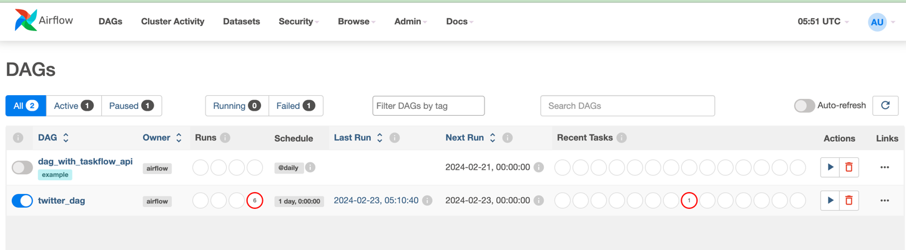
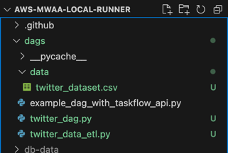
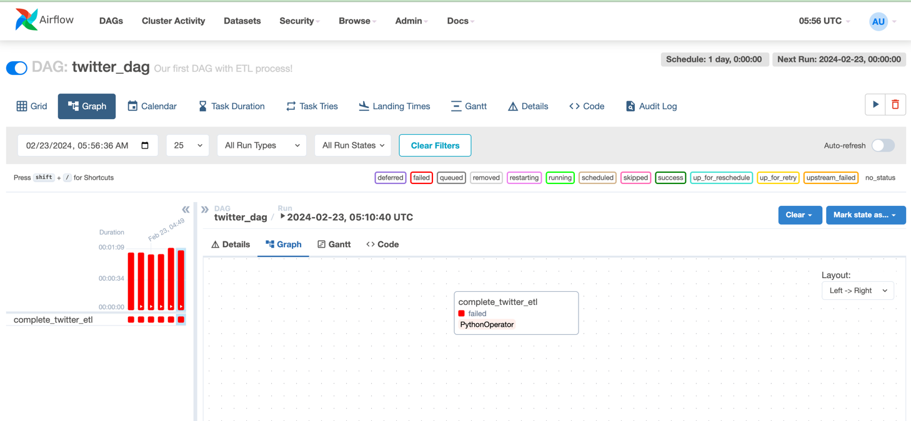

# Twitter ETL Airflow Project


## Prerequisites / Technology Used
- **macOS**: [Install Docker Desktop](https://docs.docker.com/desktop/).
- Programming Language - Python
- Apache Airflow
- Amazon Web Services (AWS) : S3

## Getting Started
```bash
git clone https://github.com/adi-tsvet/twitter-airflow-etl.git
```

```bash
git clone https://github.com/aws/aws-mwaa-local-runner.git
cd aws-mwaa-local-runner
```
## What 'aws-mwaa-local-runner' repository contains

```text
dags/
  example_lambda.py
  example_dag_with_taskflow_api.py    
  example_redshift_data_execute_sql.py
docker/
  config/
    airflow.cfg
    constraints.txt
    mwaa-base-providers-requirements.txt
    webserver_config.py
    .env.localrunner
  script/
    bootstrap.sh
    entrypoint.sh
    systemlibs.sh
    generate_key.sh
  docker-compose-local.yml
  docker-compose-resetdb.yml
  docker-compose-sequential.yml
  Dockerfile
plugins/
  README.md
requirements/  
  requirements.txt
.gitignore
CODE_OF_CONDUCT.md
CONTRIBUTING.md
LICENSE
mwaa-local-env
README.md
VERSION
```

### Step one: Building the Docker image

Build the Docker container image using the following command:

```bash
./mwaa-local-env build-image
```

**Note**: it takes several minutes to build the Docker image locally.

### Step two: Running Apache Airflow

#### Local runner

Runs a local Apache Airflow environment that is a close representation of MWAA by configuration.

```bash
./mwaa-local-env start
```

To stop the local environment, Ctrl+C on the terminal and wait till the local runner and the postgres containers are stopped.

### Step three: Accessing the Airflow UI

By default, the `bootstrap.sh` script creates a username and password for your local Airflow environment.

- Username: `admin`
- Password: `test`

#### Airflow UI

- Open the Apache Airlfow UI: <http://localhost:8080/>.



### Step four: Add DAGs and supporting files

The following section describes where to add your DAG code and supporting files. We recommend creating a directory structure similar to your MWAA environment.

#### DAGs

- Copy the following files to the `/aws-mwaa-local-runner/dags` folder for DAG code :
1. `twitter_dag.py`
2. `twitter_data_etl.py`

Note: Make sure to copy the `data` folder as well to the DAG folder in case your twitter scraper is not working. It will by default take it from the csv file.


### Step five: Run the `twitter_dag`



## Dataset Used 
Dataset link : https://www.kaggle.com/code/goyaladi/twitter-data-analysis/input?select=twitter_dataset.csv

The Twitter dataset in CSV format contains essential information about tweets from the Twitter platform. Each row represents a single tweet, and the dataset includes fields such as tweet ID, username, tweet text, retweet count, like count, and timestamp.

This concise dataset provides a snapshot of the Twitter ecosystem, enabling researchers, analysts, and enthusiasts to analyze user engagement, track trends, and gain insights into social media behavior. The CSV format facilitates easy data manipulation and integration with various analytical tools and programming languages.

## Authors

* **Adnan Ali** - Project Lead & Main Contributor

As a Master's degree holder in Computer Science from UMass Boston, I have utilized my expertise in machine learning and computer vision to spearhead the development of this integrated model system. 
With a keen eye for innovative solutions, I have orchestrated the seamless fusion of posture analysis and logo detection models, showcasing state-of-the-art techniques in the realm of AI.

Connect :
- [GitHub](https://github.com/adi-tsvet)
- [LinkedIn](https://www.linkedin.com/in/adi-tsvet/) 

## References
1. Video tutorial - https://www.youtube.com/watch?v=q8q3OFFfY6c&t=949s
2. Github project - https://github.com/darshilparmar/twitter-airflow-data-engineering-project
3. Kaggle Twitter Data Analysis Notebook - https://www.kaggle.com/code/goyaladi/twitter-data-analysis